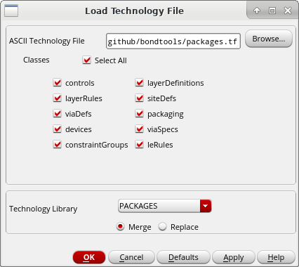
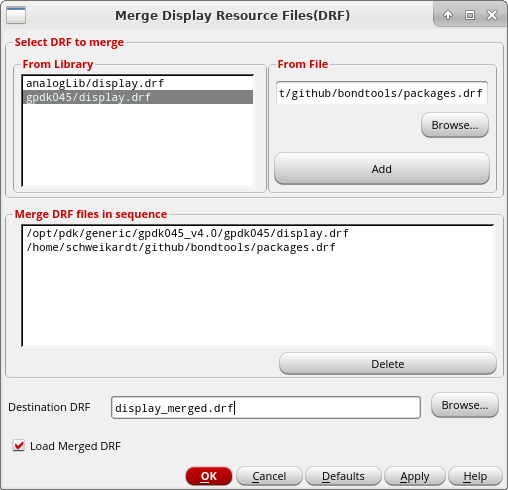

# bondtools

Toolbox for creating a bonding diagram in Cadence Virtuoso

<span style="color:red">WORK IN PROGRESS</span>

## Setup

1. Create the new library *PACKAGES* and reference it on your *PDK* library.
2. Go in  the *CIW* to *Tools> Technology File Manager* and press the 
   button *Load...* .
   Follow the instructions from the screenshot and press *OK*.

    

3. Go in  the *CIW* to *Tools> Display Resource Manager* and press the
   *Merge...*.  Merge *packages.drf* with the Display Resource File *.drf* 
   of your PDK.

    

4. Go to the *CIW* and enter the command
    ``` scheme
    (load "packages.il")
    ```
4. Add the command
    ``` scheme
    (load "bondtools.il")
    ```
   to your *.cdsinit*.
   
## Packages

<span style="color:red">WORK IN PROGRESS</span> 

### JLCC/CQFJ 

Vendor : Kyocera ([inch](https://global.kyocera.com/prdct/semicon/semi/std_pkg/pdf/kyocera-pkg-cqfj-e-inch_r0167d.pdf), [mm](https://global.kyocera.com/prdct/semicon/semi/std_pkg/pdf/kyocera-pkg-cqfj-e_r0167d.pdf))

JLCC   : J-Leaded Ceramic Chip Carrier
CQFJ   : Ceramic Quad Flat J-Leaded


| Lead Count | Die Cavity (AxB) | Drawing Number  |
| -----------|:----------------:| ---------------:|
| 44         | 0.34x0.34        |  PB-F86315      |


