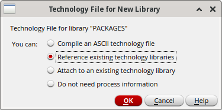
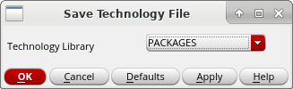
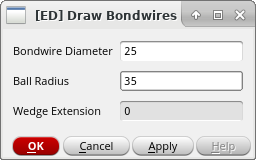
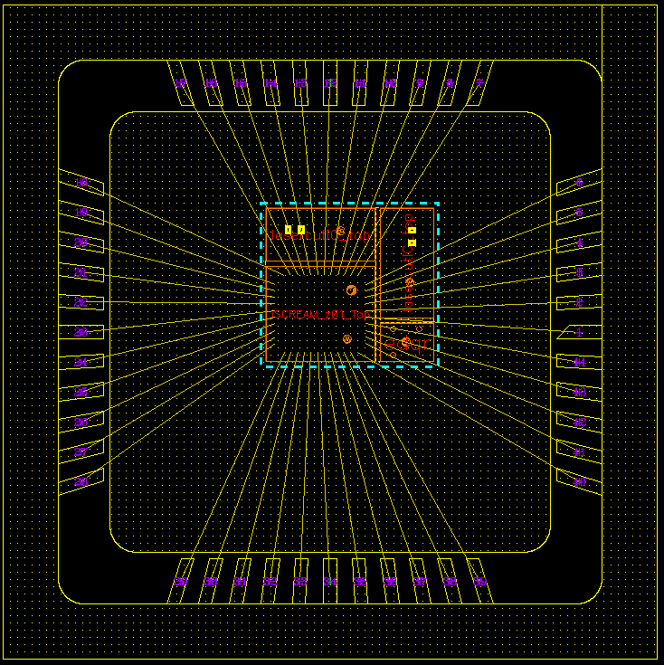
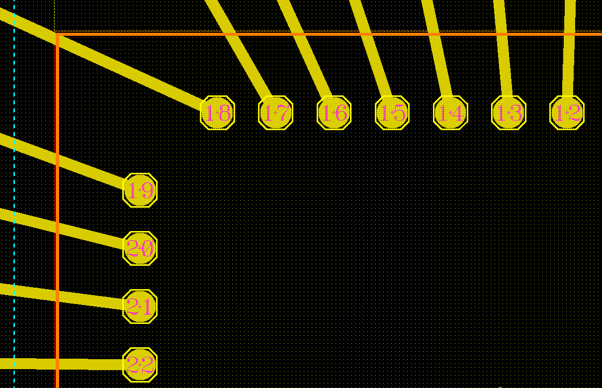
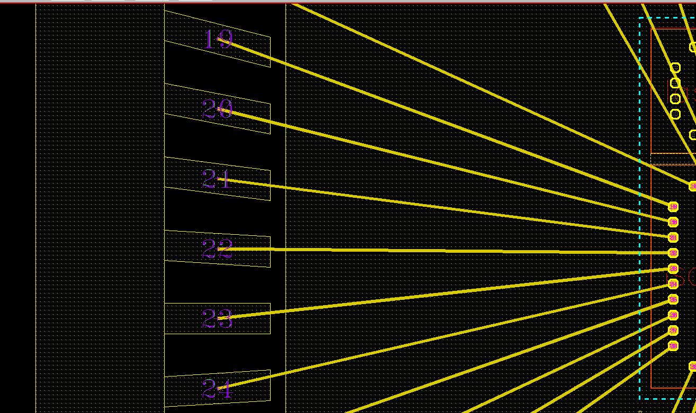

# bondtools
[](https://opensource.org/licenses/MIT)

Toolbox for creating a bonding diagram in Cadence Virtuoso.

This toolbox is used for creating bonding diagrams at
[Electronics & Drives](https://www.electronics-and-drives.de/).

## Setup

1. Create the new library *PACKAGES* and reference(!) it on your *PDK* 
   technology library.

    

3. Go in  the *CIW* to *Tools > Technology File Manager* and press the 
   button *Load...*. As a result, the *Load Technology File* form will
   open. Reference the ASCII Technology file *packages.tf* from this repository
   and *Merge* it with the library *PACKAGES* (see screenshot below).
   Confirm with *OK*.

    

3. Go in  the *CIW* to *Tools> Technology File Manager*, select the library 
   *PACKAGES* and press the button *Save...* . As a result, 
   the *Save Technology File* form will open. 
   Select the library *PACKAGES* and confirm with *OK*.

    

4. Go in  the *CIW* to *Tools> Display Resource Manager* and press the
   *Merge...*.  As a result, the *Merge Display Resource Files(DRF)* form will
   open. Choose the *.drf* from your PDK by clicking on the
   corresponding elements in the *From Library* box 
   (*gpdk045/display.drf* in the screenshot below).
   This *.drf* file is added to the list *Merge DRF Files in sequence*.
   As a second step, provide the file *packages.drf* from this repository
   to the *From file* box and push the button *Add*.
   
   Provide the name of the merged *.drf* to the field *Destination DRF*
   (*display_merged.drf*).
   Make sure that this *.drf* is loaded at the startup of Virtuoso.
   It is recommended to add the command ``drLoadDrf("display_merged.drf")``
   to your ``.cdsinit``.

    

5. Go to the *CIW* and load the file *packages.il* from the repository.
   You must load this code only once.
   Reloading is only needed when the packages are updated.
    ``` scheme
    (load "packages.il")
    ```
5. Load the file *bondtools.il* from the repository in your ``.cdsinit``.
    ``` scheme
    (load "bondtools.il")
    ```
   You can create a menu item in the layout editor with
    ``` scheme
    (load "bondtoolsMenu.il")
    ```

## Layers

The following layers are defined by this toolbox:

| Layer       | Purpose     | Description                              |
| ----------- | ----------- | ---------------------------------------- |
| PKG_MET     | drawing     | metalization in package                  |
| PKG_LBL     | label       | labels for leadframe pins                |
| BONDWIRE    | drawing     | bondwire                                 |
| BALL        | label       | position of the ball of a bondwire       |
| WEDGE       | label       | position of the wedge of a bondwire      |
| DEF_CHIP    | drawing     | outline of the chip                      |
| DEF_PAD     | drawing     | bond pads (opening in passivation)       |
| DEF_MARK    | drawing     | markings (noticeable layout structures)  |
| PKG_OUT     | drawing     | outline of the package                   |

## Usage

A bondwire can be defined by placing two labels with same name 
in the VLS (Virtuoso Layout Suite).
The first label must be placed on the bondpad and the second label must
be placed on the lead.

The ending type of bond can be specified using the 
layer (*BALL label* or *WEDGE label*).

### SKILL

The function *EDbondtoolsDrawWires* must be invoked in the 
Command Interpreter Window (CIW) to draw the bondwires.

``` scheme
(EDbondtoolsDrawWires 
  cv 
  fBallRadius
  fWireDiameter
  fWedgeExtension
  sLogfile
) => t/nil
```

The parameters of the function are

`cv`

Cellview where the bondwires are created.
You can reference the cellview in the foreground window with
``(geGetWindowCellView)`` or ``(gwc)``.

`fBallRadius`

Radius of a ball.

`fWireDiameter`

Diameter of the bondwire.

`fWedgeExtension`

Wedge extension.

`sLogfile`

Path to the logfile. No logfile is created when ``nil`` is provided

### GUI

The GUI of the tool can be invoked from the menu bar of the VLS.
Go to the element *Bondtools* and click on *Draw Bondwires*.
As a result, a GUI is shown:

  

Another way to open the GUI is to execute the 
command ``(EDbondtoolsOpenUserInterface)`` in the CIW.

Specify the parameters in the GUI and create the bondwires 
with *OK* or *Apply*.

An example of the bonding diagram of a multi-design chip is shown in the
screenshots below.

  
  
  
  
## Export

You can export the bondplan as *GDS2* using the provided *strmInOut.layermap*.

Another options is to export a *tikzpicture* with 
[ml2TikZ](https://github.com/electronics-and-drives/ml2tikz).
Use the file *layers.tex* for this purpose.

## Packages

The packages stated below are provided in the library *PACKAGES*.

### JLCC/CQFJ 

Vendor : Kyocera ([inch](https://global.kyocera.com/prdct/semicon/semi/std_pkg/pdf/kyocera-pkg-cqfj-e-inch_r0167d.pdf), [mm](https://global.kyocera.com/prdct/semicon/semi/std_pkg/pdf/kyocera-pkg-cqfj-e_r0167d.pdf))


| Cell Name         | Lead Count | Die Cavity (AxB) | Drawing Number  |
| ----------------- | ---------- | ---------------- | --------------- |
| JLCC_44_PB_F86315 | 44         | 0.34x0.34        |  PB-F86315      |
| JLCC_68_PB_F86764 | 68         | 0.4x0.4          |  PB-F86764      |

## Acronyms

| Acronym           | Description                                  |
| ----------------- | -------------------------------------------- |
| DIL               | Dual-in-line                                 |
| CSOIC             | Ceramic Small Outline Integrated Circuit     |
| CLCC              | C-Leadless Chip Carriers                     |
| JLCC              | J-Leaded Ceramic Chip Carrier                |
| CPGA              | Ceramic Pin Grid Array                       |
| SOIC              | Small Outline Integrated Circuit             |
| QFN               | Quad-Flat No-leads                           |
| CSOP              | Ceramic Small Outline Package                |
| CDIP              | Ceramic Dual Inline Package                  |
| CQFP              | Ceramic Quad Flat Package                    |
| CPGA              | Ceramic Pin Grid Array                       |
| CQFN              | Ceramic Quad Flat Non-Leaded                 |
| CQFJ              | Ceramic Quad Flat J-Leaded                   |

## License

Copyright (c) 2022 [Reutlingen University](https://www.reutlingen-university.de), [Electronics & Drives](https://www.electronics-and-drives.de) 

Permission is hereby granted, free of charge, to any person obtaining a copy
of this software and associated documentation files (the "Software"), to deal
in the Software without restriction, including without limitation the rights
to use, copy, modify, merge, publish, distribute, sublicense, and/or sell
copies of the Software, and to permit persons to whom the Software is
furnished to do so, subject to the following conditions:

The above copyright notice and this permission notice shall be included in all
copies or substantial portions of the Software.

THE SOFTWARE IS PROVIDED "AS IS", WITHOUT WARRANTY OF ANY KIND, EXPRESS OR
IMPLIED, INCLUDING BUT NOT LIMITED TO THE WARRANTIES OF MERCHANTABILITY,
FITNESS FOR A PARTICULAR PURPOSE AND NONINFRINGEMENT. IN NO EVENT SHALL THE
AUTHORS OR COPYRIGHT HOLDERS BE LIABLE FOR ANY CLAIM, DAMAGES OR OTHER
LIABILITY, WHETHER IN AN ACTION OF CONTRACT, TORT OR OTHERWISE, ARISING FROM,
OUT OF OR IN CONNECTION WITH THE SOFTWARE OR THE USE OR OTHER DEALINGS IN THE
SOFTWARE.